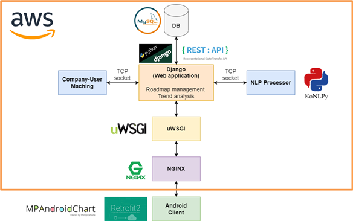
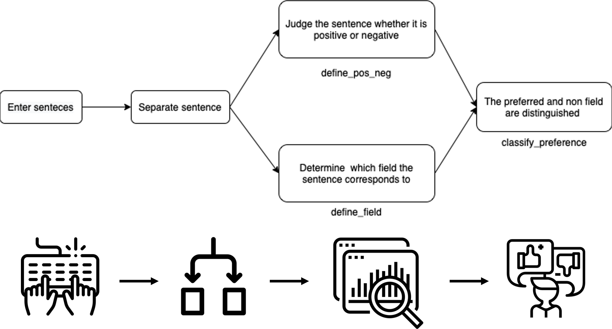
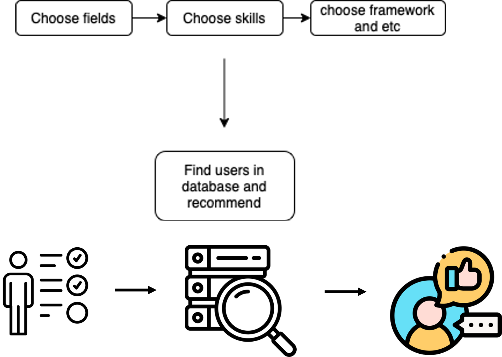

# <b>Devigation Wiki(Gachon University Graduation Project)</b>
 

## Members' Information

| Std No. | Name | Department | E-mail | Github |
|:-------:|:----:|:-------:|:-------:|:-------:|
|201835417|김동준|AI·소프트웨어학부(소프트웨어전공)|rlaehdwns99@gachon.ac.kr|[Kim-Dong-Jun99](https://github.com/Kim-Dong-Jun99)|
|201835443|김현종|AI·소프트웨어학부(소프트웨어전공)|guswhd5738@gachon.ac.kr|[DecisionDisorder](https://github.com/DecisionDisorder)|
|201835474|안해빈|AI·소프트웨어학부(소프트웨어전공)|gnh06280@gachon.ac.kr|[HaebinAHN](https://github.com/HaebinAHN)|
|201735863|이원재|AI·소프트웨어학부(소프트웨어전공)|dnjswo0213@gachon.ac.kr|[Wonjae98](https://github.com/Wonjae98)|
 

## Main Idea

최근 IT 분야의 취업 상황을 보면, 많은 사람들이 개발자가 되고자 하지만, 무엇을 어떻게 시작하고 공부해야 하는지 잘 모르는 경우가 많으며, 기업에서는 숙련된 개발자를 원하는 딜레마에 빠져있다. 이런 상황에서 예비 개발자들은 기업에서 요구하는 역량들이 무엇인지, 어떤 것을 준비해야 하는지 명확하게 알기 어려운 상황이다.  
이러한 상황 속에서 “신입 개발자를 위한 로드맵 플랫폼”, 개발자를 의미하는 Developer와 길잡이를 뜻하는 Navigation을 합친 <i>"Devigation"</i>은 어떻게 해야 기업이 원하는 인재가 될 수 있을지, 어떻게 해야 유능한 개발자가 될 수 있을 지에 초점을 맞췄다. 본 플랫폼의 목표는 신입 개발자로서 갖추어야 할 역량들과 활동들을 추천해 주고, 취업 혹은 자기계발을 돕는 것이다. 또한, IT 분야에 관심이 있는 고등학생이 진로를 결정하는 데에 도움을 주는 플랫폼으로도 확장될 수 있을 것이다.

Looking at the recent employment situation in the IT sector, many people want to become developers, but they often don't know what to start and how to study, and companies are in a dilemma of wanting skilled developers. In this situation, it is difficult for prospective developers to clearly know what capabilities the company requires and what to prepare.  
Against this backdrop, <i>"Devigation,"</i> which combines "roadmap platform for new developers," developer, and navigation, which means guide, focused on how to become the talent that companies want and how to become competent developers. The goal of this platform is to recommend the competencies and activities that new developers should have, and to help them get a job or develop themselves. In addition, it can be expanded to a platform that helps high school students interested in the IT field decide their careers.  
 

## Structure & Development environment

AWS EC2를 사용해서 개발한 파이썬 기반의 Django 웹 애플리케이션, uWSGI, NGINX와 MySQL 데이터베이스를 배포하였다. 안드로이드 클라이언트가 Django와 Retrofit2 및 Rest Framework를 통해 통신을 하며, Python 언어를 이용해 KoNLPy 라이브러리를 사용하는 NLP 프로세서와, 기업-유저 간 매칭 시스템이 소켓 통신으로 입력받은 데이터를 처리한 후 Django에서 리턴 받아 DB에 저장 및 사용자에게 정보 전달 한다. 안드로이드에서는 그래프 표현을 위해 MPAndroidChart를 사용하였다. 이를 설명하는 다이어그램을 다음과 같이 확인할 수 있다.

We deployed Python-based Django web applications, uWSGI, NGINX, and MySQL databases developed using AWS EC2. The Android client communicates with Django through Retrofit2 and Rest Framework, the NLP processor using the KoNLPy library using Python language, and the company-user matching system processes the data entered through socket communication, then returns it from Django, stores it in DB, and delivers information to users. In Android, MPA Android Chart was used for graph representation. The diagram explaining this can be found as follows.

다음은 사용자 설문에서 쓰이는 자연어 처리 과정이다. 문자열을 사용자에게 입력받으면, 문장별로 구분한 후에 각 문장이 어떤 분야에 대해 언급하는지와 해당 문장이 그 분야를 선호하는 내용인지 아닌지 판단한다. 이를 종합해서 사용자의 선호와 비선호 분야를 구분하여 DB에 분리해 저장한다.  
The following is the natural language processing process used in user surveys. When a string is entered by a user, it is divided by sentence and then determined which field each sentence refers to and whether the sentence prefers the field. Collectively, the user's preference and non-preference fields are divided and stored in the DB.

기업과 개인회원을 매칭해 주는 알고리즘이다. 기업 회원이 분야, 기술, 프레임워크 등을 설문하면 개인의 경험과 로드맵 진행도를 기반으로 유사한 유저들을 리스트 형태로 추천한다.  
This is is an algorithm that matches companies and individual members. When corporate members survey fields, technologies, and frameworks, similar users are recommended in the form of lists based on individual experiences and road map progress.

 

### Development Tools
#### Frontend
- Android Studio 2021.3.1
    - JDK 11.0.13
    - Min SDK Version: 21
    - Target SDK Version: 32
- Retrofit2 v.2.9.0
    - Converter-gson v2.9.0
    - okhttp3 v3.12.1
    - MPAndroidChart v3.1.0
#### Backend
- Python : 3.9
- Databse : MySQL
- Django : 4.1
- DjangoRestFramework : 3.13.1
#### Employment Data Collector
- Java JDK 1.8
- GUI: Swing & AWT
- JSON: Json simple v1.1.1 & GSON
- Saramin Open API
#### NLP & Company-User matching Algorithm
- Jupyter Notebook
- VSCode
- Python 3.10.11
- KoNLPy
    - OKT (Open Korean Text)  
 

## Screenshots

</img>
</img>
</img>
</img>
</img>
</img>
</img>
</img>
</img>
</img>
</img>
</img>
</img>
</img>
</img>
</img>
</img>
</img>
</img>
</img>  
 

 

## Wiki about each feature: For more information 

[Wiki for Django Backend](https://github.com/GachonUniv-GraduationProject/django-backend#readme)

[Wiki for Employment Data Collector](https://github.com/GachonUniv-GraduationProject/EmploymentDataCollector/tree/master#readme)

[Wiki for NLP Processor](https://github.com/GachonUniv-GraduationProject/NLP-Processor/tree/main#readme)

[Wiki for Company User Matcher](https://github.com/GachonUniv-GraduationProject/Company-UserMatcher/tree/main#readme)

[Wiki for Android Frontend](https://github.com/GachonUniv-GraduationProject/Android-Frontend#readme)  
 

## Presentation Videos

졸업작품1 발표영상 

졸업작품2 발표영상 

졸업작품3 발표영상 

